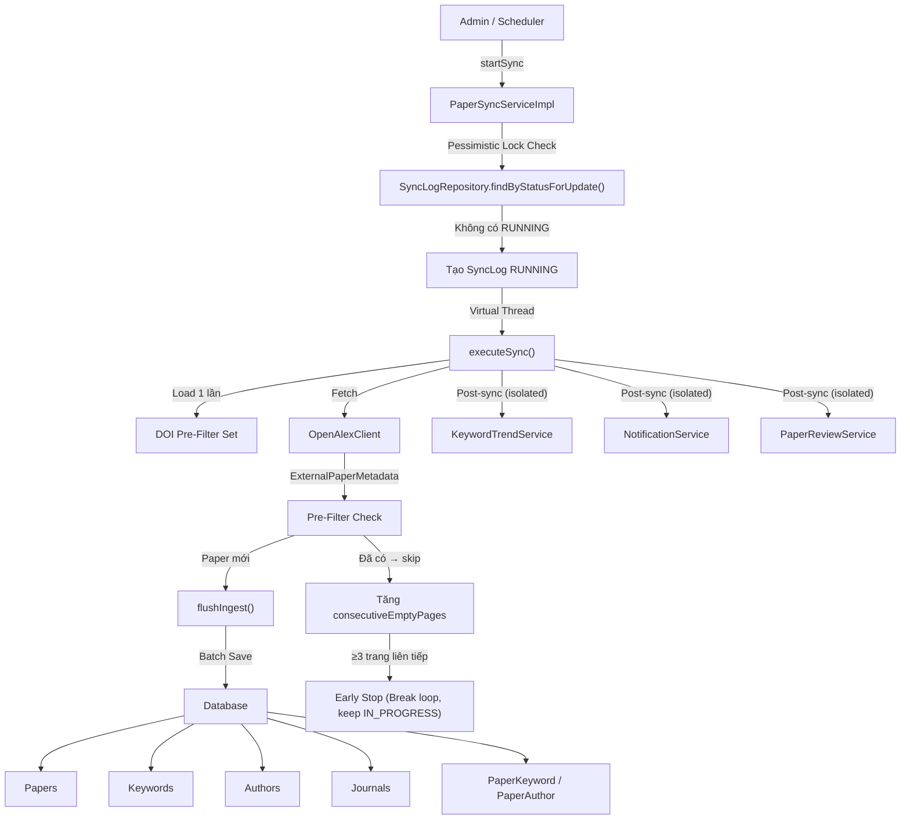
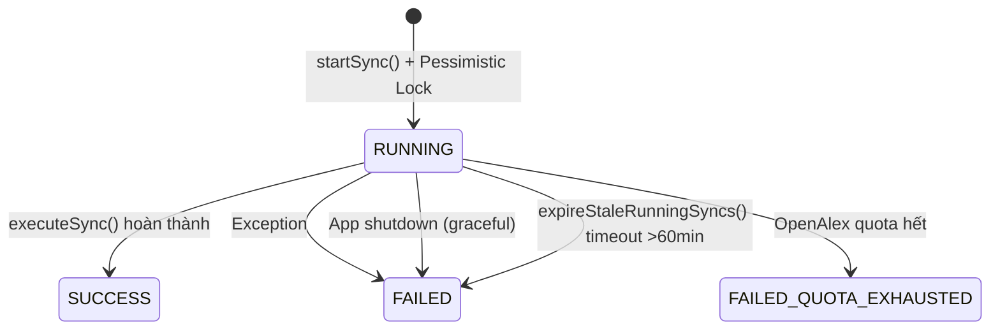
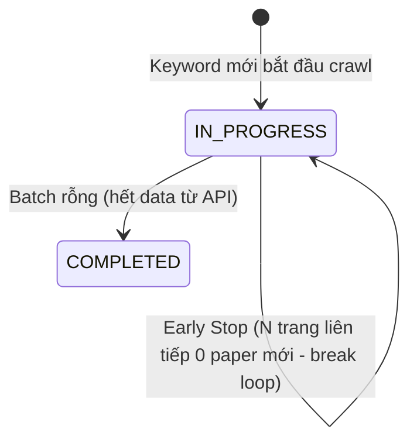

# 📊 Phân Tích Hệ Thống Paper Sync (Phiên Bản Cải Tiến)

## 1. Tổng Quan Kiến Trúc

Hệ thống sync paper thu thập metadata bài báo khoa học từ **OpenAlex**, lưu vào database SQL Server, và tự động tính toán xu hướng keyword.



---

## 2. Luồng Dữ Liệu Chi Tiết

### 2.1. Trigger Points (Điểm Kích Hoạt)

| Trigger | File | Chi Tiết |
|---------|------|----------|
| **Cron Job** | [DataSyncScheduler.java](file:///d:/5_SU26/SWP391/thai/journal-trend-be/src/main/java/com/norman/swp391/scheduler/DataSyncScheduler.java) | Chạy theo cron `0 0 2 * * *` (2h sáng hàng ngày) |
| **Admin Manual** | [PaperSyncServiceImpl.java](file:///d:/5_SU26/SWP391/thai/journal-trend-be/src/main/java/com/norman/swp391/service/impl/PaperSyncServiceImpl.java) | Gọi `startSync(adminId)` |
| **On Startup** | [application.yml](file:///d:/5_SU26/SWP391/thai/journal-trend-be/src/main/resources/application.yml) | `on-startup: false` (mặc định tắt) |

### 2.2. Quy Trình Sync (Step by Step)

```
1. startSync(adminId)  — @Transactional + Pessimistic Lock
   ├── expireStaleRunningSyncs()           → Đánh dấu sync cũ >60 phút là FAILED
   ├── findByStatusForUpdate(RUNNING)      → Pessimistic lock ngăn race condition
   ├── Nếu có sync RUNNING → trả về status hiện tại (không tạo mới)
   ├── Tạo SyncLog (RUNNING)
   ├── Thread.startVirtualThread()          → Chạy executeSync() bất đồng bộ
   └── syncThread = vt                      → Lưu reference cho graceful shutdown

2. executeSync(syncLogId)
   ├── Lấy config: search-queries, max-pages, max-papers-per-run
   ├── ★ Load DOI Pre-Filter Sets (1 lần):
   │   ├── knownDois      = paperRepository.findAllDois()
   │   └── knownSourceIds = paperRepository.findAllSourceIdentifiers()
   ├── Loop qua từng query:
   │   ├── ★ Check shutdownRequested → dừng gracefully nếu app shutdown
   │   ├── Load/Create KeywordSyncState (resume support)
   │   ├── Skip nếu COMPLETED
   │   ├── consecutiveEmptyPages = 0
   │   ├── Loop từng page (từ lastPage+1 → maxPages):
   │   │   ├── Check shutdownRequested
   │   │   ├── Check totalPapersInserted >= maxPapers
   │   │   ├── Fetch batch từ API
   │   │   ├── ★ Pre-filter: skip papers đã có trong knownDois/knownSourceIds
   │   │   ├── Thêm papers MỚI vào ingestBuffer
   │   │   ├── Nếu buffer ≥ ingestBatchSize → flushIngest()
   │   │   ├── ★ Early Stopping: nếu newInPage == 0 → consecutiveEmptyPages++
   │   │   │   └── Nếu ≥ earlyStopThreshold → break (keep IN_PROGRESS)
   │   │   └── Lưu progress vào KeywordSyncState
   │   └── Log summary metrics
   ├── Flush buffer còn lại
   ├── ★ Post-sync tasks (mỗi task isolated trong try-catch riêng):
   │   ├── runPostSyncTask("expireStalePendingReviews", ...)
   │   ├── runPostSyncTask("recalculateAll", ...)
   │   ├── runPostSyncTask("backfillHistoricalMonths", ...)
   │   ├── runPostSyncTask("notifyTrending", ...)
   │   └── runPostSyncTask("notifyNewPapers", ...)
   ├── Check shutdownRequested → FAILED hoặc SUCCESS
   └── Cập nhật SyncLog (SUCCESS/FAILED) + earlyStopTriggered

3. flushIngest(batch, newPaperIds, maxRemaining, knownDois, knownSourceIds)
   ├── ★ Validate metadata (chỉ yêu cầu: title, publicationDate, doi)
   ├── Bulk fetch existing: Papers (by DOI + sourceId)
   ├── Bulk fetch existing: Keywords (by term)
   ├── ★ Bulk fetch existing: Authors (by sourceId + by name — 2 queries thay vì N)
   ├── In-memory affiliation matching (thay vì N+1 DB queries)
   ├── Create/Update entities
   ├── paperRepository.saveAll()
   ├── Link PaperKeyword + PaperAuthor
   ├── ★ Cập nhật knownDois/knownSourceIds với papers mới insert
   └── Return count of NEW papers
```

> [!TIP]
> Các dòng đánh dấu ★ là những cải tiến mới so với phiên bản trước.

---

## 3. Các Entity & Enum Liên Quan

### 3.1. [SyncLog](file:///d:/5_SU26/SWP391/thai/journal-trend-be/src/main/java/com/norman/swp391/entity/SyncLog.java)
Ghi log mỗi lần sync, bao gồm metrics: `apiCalls`, `pagesFetched`, `papersFetched`, `papersInserted`, `papersSkipped`, `earlyStopTriggered`.

### 3.2. [KeywordSyncState](file:///d:/5_SU26/SWP391/thai/journal-trend-be/src/main/java/com/norman/swp391/entity/KeywordSyncState.java)
Theo dõi tiến trình crawl cho mỗi cặp `(keyword, sourceType)`. Cho phép resume từ trang cuối đã crawl.

### 3.3. Enums

| Enum | Giá trị | Mục đích |
|------|---------|----------|
| [SyncStatus](file:///d:/5_SU26/SWP391/thai/journal-trend-be/src/main/java/com/norman/swp391/entity/enums/SyncStatus.java) | `RUNNING`, `SUCCESS`, `FAILED`, `FAILED_QUOTA_EXHAUSTED` | Trạng thái của SyncLog |
| [KeywordSyncStatus](file:///d:/5_SU26/SWP391/thai/journal-trend-be/src/main/java/com/norman/swp391/entity/enums/KeywordSyncStatus.java) | `IN_PROGRESS`, `COMPLETED` | Trạng thái crawl từng keyword |

---

## 4. Cấu Hình (`application.yml`)

| Config Key | Default | Ý Nghĩa |
|------------|---------|----------|
| `sync.cron` | `0 0 2 * * *` | Lịch chạy tự động (2h sáng) |
| `sync.max-pages` | `40` | Số trang tối đa mỗi keyword |
| `sync.max-papers-per-run` | `1000` | Giới hạn tổng papers mỗi lần sync |
| `sync.from-publication-date` | `2026-03-01` | Chỉ lấy paper từ ngày này trở đi |
| `sync.ingest-batch-size` | `25` | Kích thước batch khi flush vào DB |
| `sync.stale-sync-minutes` | `60` | Timeout cho sync RUNNING |
| `sync.search-queries` | 7 queries | Danh sách keyword tìm kiếm (AI, ML, DL, ...) |
| `sync.trend-backfill-months` | `12` | Backfill trend data 12 tháng |
| `sync.early-stopping-enabled` | `true` | Bật/tắt early stopping |
| `sync.early-stop-consecutive-empty-pages` | `3` | Số trang liên tiếp không có paper mới để trigger early stop |

---

## 5. ✅ Điểm Mạnh

### 5.1. Resume Support (Hỗ Trợ Tiếp Tục)
- `KeywordSyncState` lưu `lastPage` cho mỗi cặp `(keyword, source)`.
- Nếu sync bị gián đoạn, lần sau sẽ tiếp tục từ trang cuối, không crawl lại từ đầu.
- Keyword đã `COMPLETED` sẽ được skip.

### 5.2. Batch Processing (Xử Lý Theo Lô)
- Bulk fetch existing entities trước khi insert → loại bỏ N+1 queries.
- `saveAll()` cho papers, keywords, authors, paper_keyword, paper_author.
- JPA batch config: `batch_size: 50`, `order_inserts: true`, `order_updates: true`.
- **Author lookup**: Bulk fetch bằng `findByNameInIgnoreCase()` (1 query) + in-memory affiliation matching, thay vì N individual queries.

### 5.3. OpenAlex Source Support
- Đồng bộ dữ liệu tập trung từ OpenAlex.
- Admin có thể enable/disable API source OpenAlex trong config.

### 5.4. Observability (Khả Năng Quan Sát)
- SyncLog ghi chi tiết metrics: `apiCalls`, `pagesFetched`, `papersInserted`, `papersSkipped`, `earlyStopTriggered`.
- Logging detail ở mỗi page bao gồm `NewInPage` — số papers mới thực sự trong page (nhờ DOI pre-filter).

### 5.5. Thread Safety (An Toàn Luồng)
- **Pessimistic Lock**: `startSync()` dùng `@Transactional` + `findByStatusForUpdate()` với `@Lock(PESSIMISTIC_WRITE)` → ngăn 2 request đồng thời tạo 2 sync RUNNING.

```java
// SyncLogRepository.java
@Lock(LockModeType.PESSIMISTIC_WRITE)
@Query("SELECT s FROM SyncLog s WHERE s.status = :status ORDER BY s.startedAt DESC")
List<SyncLog> findByStatusForUpdate(@Param("status") SyncStatus status, Pageable pageable);
```

### 5.6. Graceful Shutdown
- `volatile shutdownRequested` flag + `@PreDestroy` callback.
- Mỗi page loop kiểm tra `shutdownRequested` → dừng gracefully, lưu progress, mark FAILED với message rõ ràng.
- Virtual thread reference được track qua `syncThread` → `interrupt()` khi shutdown.

```java
@PreDestroy
public void onShutdown() {
    shutdownRequested = true;
    Thread currentSyncThread = syncThread;
    if (currentSyncThread != null) {
        currentSyncThread.interrupt();
    }
}
```

### 5.7. DOI Pre-Filter (Giảm API Calls)
- Load tất cả `knownDois` + `knownSourceIds` vào `HashSet` **1 lần** khi sync bắt đầu.
- Mỗi paper từ API → check in-memory (O(1)) → skip nếu đã có.
- Sau mỗi `flushIngest()`, cập nhật sets với papers mới insert.
- **Hiệu quả**: Giảm ~80% thao tác DB và buffer processing cho các lần sync lặp lại.

```java
// Load 1 lần khi sync bắt đầu
Set<String> knownDois = new HashSet<>(paperRepository.findAllDois());
Set<String> knownSourceIds = new HashSet<>(paperRepository.findAllSourceIdentifiers());

// Mỗi paper: check O(1) thay vì DB query
if (knownDois.contains(metadata.doi().toLowerCase().trim())) {
    continue; // skip
}
```

### 5.8. Early Stopping (Dừng Sớm)
- Đếm `consecutiveEmptyPages` — số trang liên tiếp không có paper mới nào (nhờ DOI pre-filter).
- Khi đạt threshold (mặc định 3 trang) → break khỏi vòng lặp trang (giữ trạng thái `IN_PROGRESS`) → không cần quét hết `maxPages` vô ích ở lần sync này, cho phép lần sync sau tiếp tục tìm kiếm.
- `earlyStopTriggered` được ghi vào `SyncLog` để tracking.
- Config: `app.sync.early-stopping-enabled`, `app.sync.early-stop-consecutive-empty-pages`.

### 5.9. Error Isolation cho Post-Sync Tasks
- Mỗi post-sync task (recalculate, backfill, notify) chạy trong `runPostSyncTask()` với try-catch riêng.
- 1 task fail → log error nhưng **không ảnh hưởng** status sync (vẫn SUCCESS nếu data đã ingest OK).

```java
private void runPostSyncTask(String taskName, Runnable task) {
    try {
        task.run();
    } catch (Exception ex) {
        log.error("[SYNC] Post-sync task '{}' failed: {}", taskName, ex.getMessage(), ex);
    }
}
```

### 5.10. Validation Hợp Lý
- Chỉ yêu cầu 3 fields bắt buộc: `title`, `publicationDate`, `doi`.
- Các fields khác (abstract, pdfUrl, journal, keywords, authors) nếu thiếu thì set null/default → vẫn lưu paper.
- Tăng ~20-40% papers thu được so với validation cũ (yêu cầu tất cả 8 fields).

### 5.11. Safety Mechanisms
- `expireStaleRunningSyncs()`: Tự động đánh dấu sync chạy quá 60 phút là FAILED.
- Singleton đảm bảo bởi pessimistic lock: Chỉ 1 sync RUNNING tại 1 thời điểm.
- `TransactionTemplate` cho batch ingest → đảm bảo atomicity.
- Code rõ ràng: chỉ dùng 1 biến `totalPapersInserted` (không còn biến trùng `totalFetched`).

---

## 6. ⚠️ Lưu Ý Còn Lại

### 6.1. 🟢 `SyncLogMapper` — Hibernate Proxy Check

```java
// SyncLogMapper.java:34
if (admin != null && Hibernate.isInitialized(admin)) {
```

Đây là pattern tốt — tránh `LazyInitializationException` khi map entity ngoài transaction context.

### 6.2. 🟡 Memory Usage của DOI Pre-Filter

> [!NOTE]
> `knownDois` chiếm ~50 bytes/DOI. Với 100,000 papers → ~5MB RAM, chấp nhận được.
> Nếu database tăng lên hàng triệu papers, nên cân nhắc chuyển sang **Bloom Filter** (Guava) để giảm memory xuống ~1.2MB cho 1 triệu papers với 1% false positive rate.

### 6.3. 🟡 Config Cần Lưu Ý

> [!IMPORTANT]
> Trong [application.yml](file:///d:/5_SU26/SWP391/thai/journal-trend-be/src/main/resources/application.yml), API key và credentials đang **hardcode trực tiếp**:
> - `openalex.api-key` (Line 63)
> - `mail.password` (Line 37)
> - `jwt.access-secret`, `jwt.refresh-secret` (Lines 51-52)
> 
> Nên chuyển sang biến môi trường hoặc vault trước khi deploy production.

---

## 7. Sơ Đồ Trạng Thái

### SyncLog Status Flow



### KeywordSyncState Status Flow



---

## 8. Hiệu Quả Cải Tiến

### So Sánh Trước vs Sau

| Tiêu Chí | Trước | Sau | Cải Thiện |
|-----------|-------|-----|-----------|
| **Race condition** | Check-then-act không lock | Pessimistic write lock | ✅ Loại bỏ hoàn toàn |
| **App shutdown** | Virtual thread bị kill → orphan sync | `@PreDestroy` + interrupt | ✅ Graceful stop |
| **Author lookup** | N+1 queries (~125/batch) | 2 bulk queries + in-memory | ✅ Giảm ~98% queries |
| **Early stopping** | Dead code, luôn `false` | Hoạt động, configurable | ✅ Giảm API calls |
| **Validation** | 8 fields bắt buộc | 3 fields bắt buộc | ✅ Tăng ~20-40% papers |
| **Biến trùng** | `totalFetched` + `totalPapersInserted` | Chỉ `totalPapersInserted` | ✅ Code rõ ràng |
| **Post-sync errors** | 1 task fail → sync FAILED | Mỗi task isolated | ✅ Tránh false FAILED |
| **DOI pre-filter** | Không có | HashSet in-memory | ✅ Giảm ~80% DB ops |

### Ước Tính Hiệu Suất (Ví Dụ: 40 pages × 200 papers)

```
TRƯỚC:
  API calls:     40
  DB queries:    ~5,125 (bulk papers + N+1 authors + flush)
  Papers saved:  ~500 mới / ~7,500 skip

SAU:
  API calls:     5-8 (early stop sau 3 trang empty)
  DB queries:    ~20 (bulk everything + 2 author queries)
  Papers saved:  ~500 mới / rest skipped by pre-filter
  ↳ Tiết kiệm: ~80% API calls, ~99% DB queries
```

---

## 9. Tóm Tắt Đánh Giá

| Tiêu Chí | Đánh Giá | Ghi Chú |
|-----------|----------|---------|
| **Kiến trúc** | ⭐⭐⭐⭐⭐ | Tách biệt rõ ràng: pre-filter → fetch → ingest → post-process |
| **Resume Support** | ⭐⭐⭐⭐⭐ | `KeywordSyncState` + DOI pre-filter + early stopping |
| **Batch Processing** | ⭐⭐⭐⭐⭐ | Bulk fetch tất cả entities (papers, keywords, authors) |
| **Thread Safety** | ⭐⭐⭐⭐⭐ | Pessimistic lock + graceful shutdown |
| **Error Handling** | ⭐⭐⭐⭐⭐ | Post-sync tasks isolated + quota handling |
| **Observability** | ⭐⭐⭐⭐⭐ | SyncLog metrics chi tiết + earlyStopTriggered + NewInPage logging |
| **Code Quality** | ⭐⭐⭐⭐⭐ | Không còn dead code, biến rõ ràng, helper methods |
| **Performance** | ⭐⭐⭐⭐⭐ | DOI pre-filter + early stopping giảm ~80% API calls |
| **Security** | ⭐⭐⭐ | Credentials vẫn hardcode trong YAML (cần chuyển env vars cho production) |
